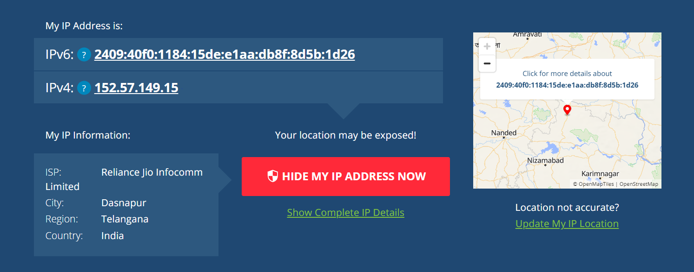
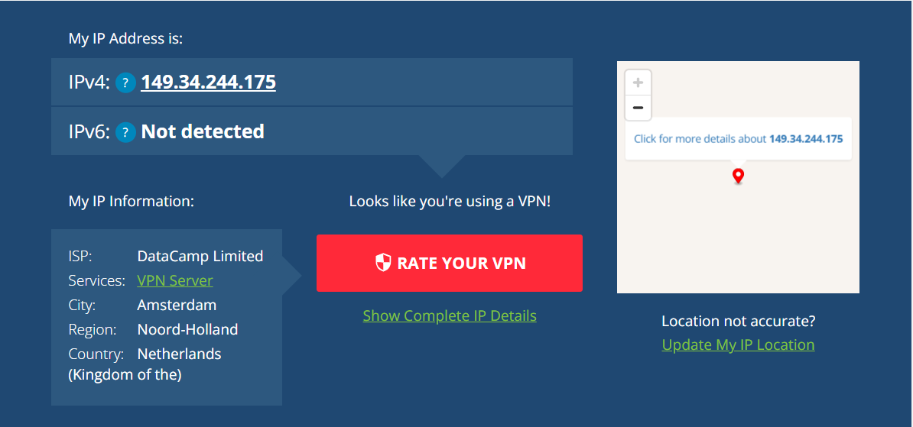
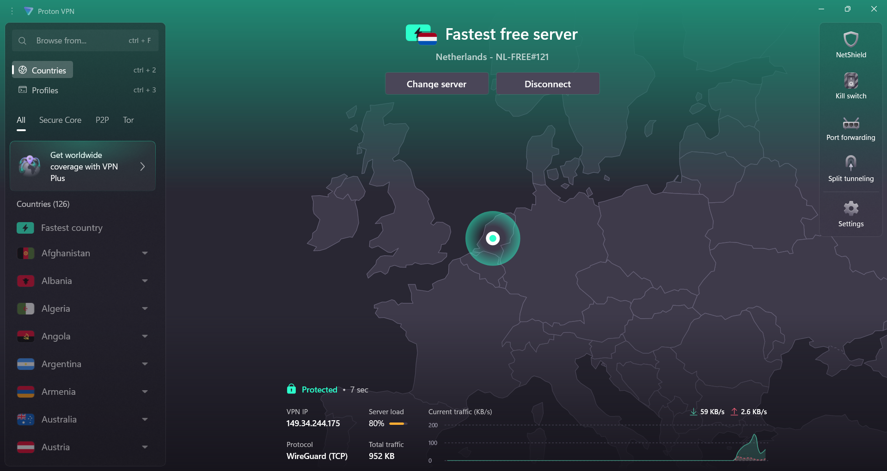

# Cyber Security Internship - Task 8: Working with VPNs

## Objective
To understand the role of VPNs in privacy, encryption, and secure communication by setting up and testing ProtonVPN.

## Steps Performed
1. Installed ProtonVPN (Free tier).
2. Checked real IP using [whatismyipaddress.com](https://whatismyipaddress.com).
3. Connected to ProtonVPN (Netherlands server).
4. Verified new IP and location.
5. Browsed websites to confirm encrypted connection.
6. Compared browsing speed with and without VPN.
7. Documented benefits and limitations of VPNs.

## Deliverables
- **Screenshots** (before/after IP + VPN connected)

## Tools Used
- ProtonVPN Free
- Windows 11 Laptop
- WhatIsMyIPAddress.com

## Screenshots
| Before VPN | After VPN | Connected |
|------------|-----------|-----------|
|  |  |  |

---

## Key Learnings
- VPN hides your real IP and encrypts traffic.
- VPN improves security on public Wi-Fi.
- Browsing speed is usually slower when VPN is active.
- Free VPNs have limited servers and bandwidth.
- VPNs enhance privacy but do not guarantee complete anonymity.

---
